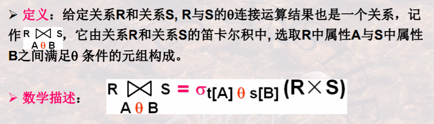
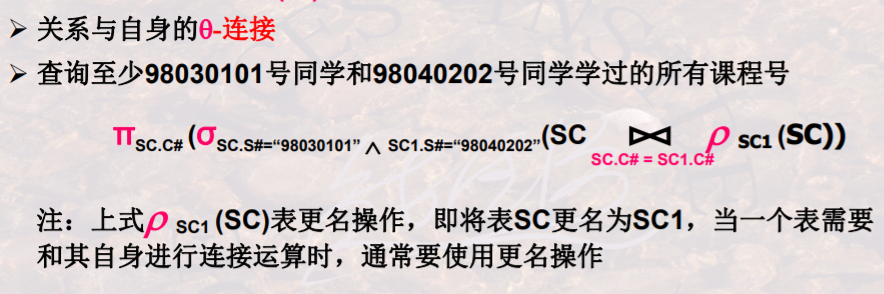

# 04 关系代数

- 基本操作：并、差、积、选择、投影（更名）
- 扩展操作：交、连接、除

用对关系的运算来表达查询，需要指明所用操作, 具有一定的过程性

## 关系代数基本操作

某些操作，如并、差、交等，需要满足“并相容性”

- 两个关系的属性数目相同
- 两个关系对应位置的属性的域相同

基本操作

- 并
- 差
- 积（笛卡尔积）
- 选择
- 投影

## 关系代数之扩展操作

- 交

- $\theta$-连接

  

  关系与自身的θ连接，需要更名操作

  

  - 等值连接
  - 自然连接（所有相同的属性值都要相同）
- 除
- 外连接 （连接时缺失元组用空值表示）
  