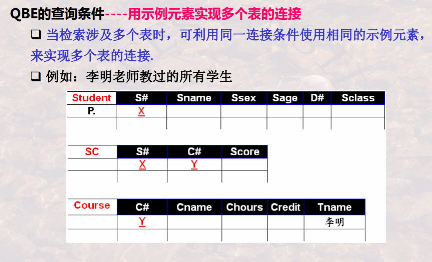
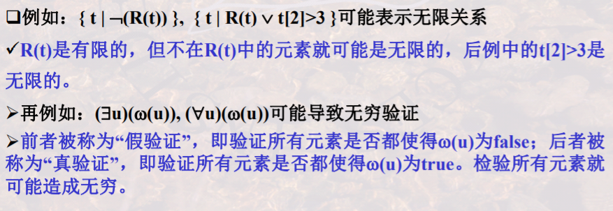

# 05 关系演算

- 元组演算
- 域演算
- 安全性

## QBE语言

- 下划线：示例元素，示例元素下划线上面的值不 起作用，被当作域变量名称来对待，只用于占位或是连接条件
- 或运算用不同的示例元素
- 与运算用相同的示例元素

## 关系运算的安全性

不产生无限关系和无穷验证的运算被称为是安全的

- 关系代数是一种集合运算，是安全的

- 关系演算不一定是安全的

  - 例如

    