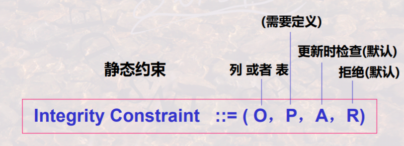
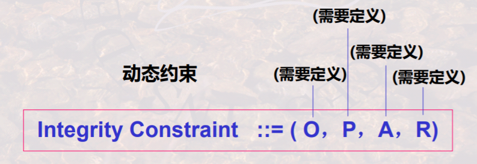
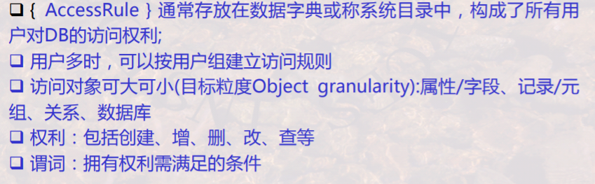
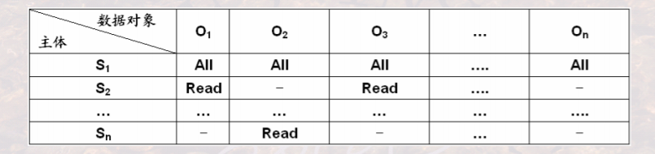
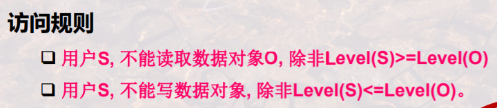

# 08 数据库完整性和安全性

重点与难点

- 完整性概念，完整性规则，静态约束动态约束
- 安全性概念，安全性访问规则，权利与授权

SQL完整性：DDL定义

安全性：DCL定义

## 数据库完整性

概念

- 任何情况下的正确性、有效性和一致性

关系模型中

- 实体完整性
- 参照完整性
- 用户自定义完整性

完整性约束条件的一般形式：O P A R

- O：数据集合，约束的对象
- P：谓词条件：什么样的约束
- A：触发条件：什么时候检查
- R：相应动作：不满足时怎么办

按约束对象分类：

- 域完整性约束（某一列）
- 关系完整性约束（对元组或不同关系间元组的联系的判断）

按约束来源分类：

- 结构约束：例如函数依赖约束、主键约束(实体完整性)、外键约束(参照完整性)，只关心数值相等与否、是否允许空值等
- 内容约束：来自于用户的约束，关心取值范围

按约束状态分类：

- 静态约束：任一时刻都应满足的约束
- 动态约束：发生改变时应满足的约束，如工资只能升不能降

SQL：

静态约束

- 列完整性
- 表完整性

动态约束

- 触发器

### SQL语言实现静态完整性

create table  列约束

create table 表约束

assertion

###SQL语言实现动态完整性

触发器 Trigger

## 数据库安全性

自主安全性：授权，通过权限在用户之间的传递，使用户自主管理数据库安全性

自主安全性访问规则：

S O t P

- S：请求主体（用户
- O：访问对象
- t：访问权利
- P：谓词

自主安全性的实现方式：

1. 存储矩阵

   

2. 视图

   创建视图

### SQL - DCL

Grant 授权

Grant ...(权利) on ..(表名) to xxx(用户)   [with grant option :可以继续传播];  

Revoke 收回授权

Revoke ... on ... from xxx;

## 强制安全性

强制安全性通过对**数据对象**进行安全性分绩

同时也对**用户**进行上述的安全性分级

