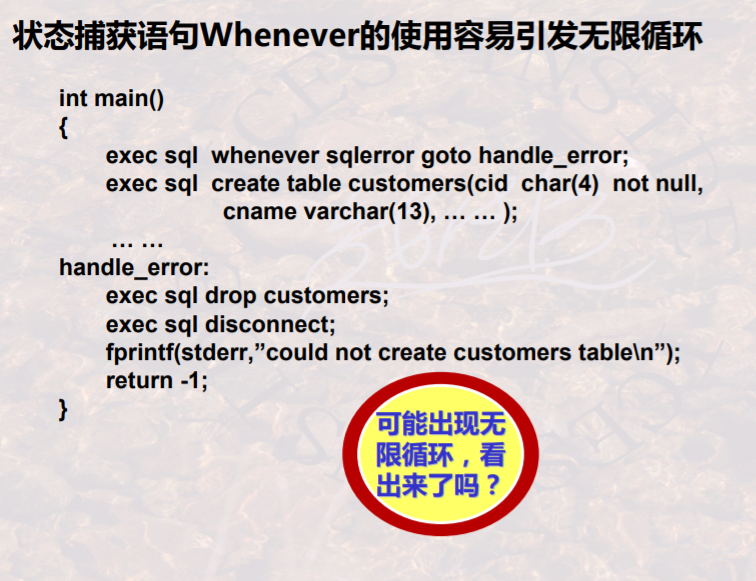
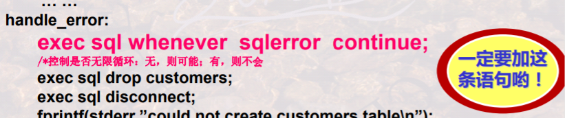

# 09 嵌入式SQL基本技巧（事务）

## 事务

事务的特性ACID

- A：原子性，事务的一组更新要么全做要么全不做
- C：一致性：正确的（它是进一步由隔离性来保证的）
- I：隔离性，并发的多个事务之间互相不受影响
- D：持久性，事务的影响是持久的，被撤销事务的影响是可恢复的

## 数据集与游标

检索单行结果可以直接传给宿主程序的变量

多行结果需要用游标

游标(Cursor)的使用需要先定义、再打开(执行)、接着一条接一条处理，最后再关闭

游标可以定义一次，多次打开(多次执行)，多次关闭

**打开的时候才执行**，定义没有执行

- 删除
  - 查找删除
  - 定位删除
- 更新
  - 查找更新
  - 定位更新
- 插入
  - 只有一种插入

## 状态捕获及错误处理

状态捕获及处理有三部分

- 设置SQL通信区

  exec sql include sqlca

- 设置状态捕获语句

  exec sql whenever condition action；

  有作用域

- 状态处理语句

  report_error: exec sql rollback;

### 状态捕获语句

Whenever语句的作用是设置一个“条件陷阱”, 该条语句会对其**后面的所有 由Exec SQL语句所引起的**对数据库系统的调用自动检查它是否满足条件(由 condition指出)

- 状态捕获语句Whenever的作用范围是其后的所有Exec SQL语句，一直到程 序中出现另一条相同条件的Whenever语句为止，后面的将覆盖前面的。

**作用域看的是语句的位置，而不是逻辑上的流程**

