# 18 数据库索引

- 索引文件
- 主文件

**索引文件组织方式有两种**

- 排序索引文件
- 散列索引文件

有索引时 更新操作要同时更新索引文件和主文件

## 稠密索引与稀疏索引

### 稠密索引

对于主文件中每一个记录(形成的每一个索引字段值)，都有一个索引项和它 对应，指明该记录所在位置。

### 稀疏索引

对于主文件中部分记录(形成的索引字段值)，有索引项和它对应

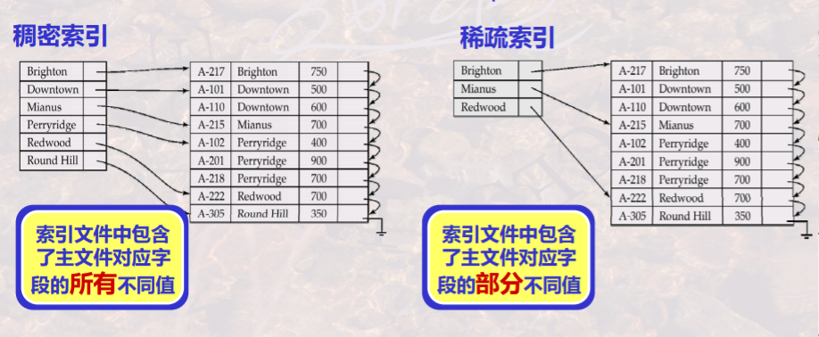**稀疏索引要求主文件必须按索引字段属性排序存储**

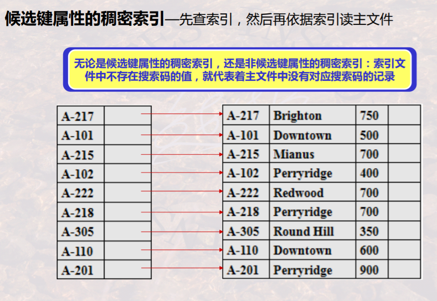

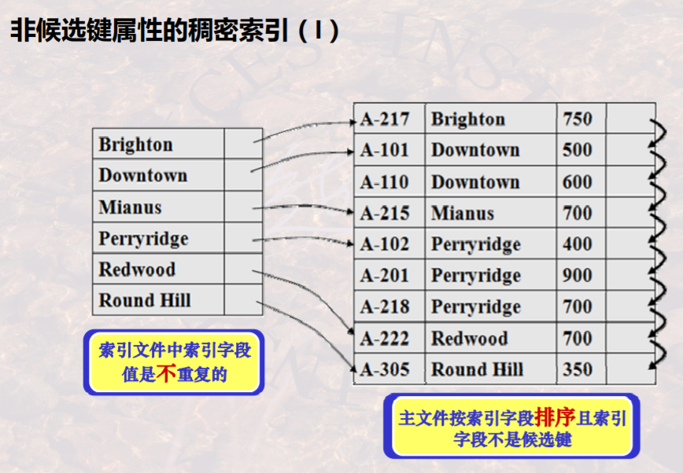

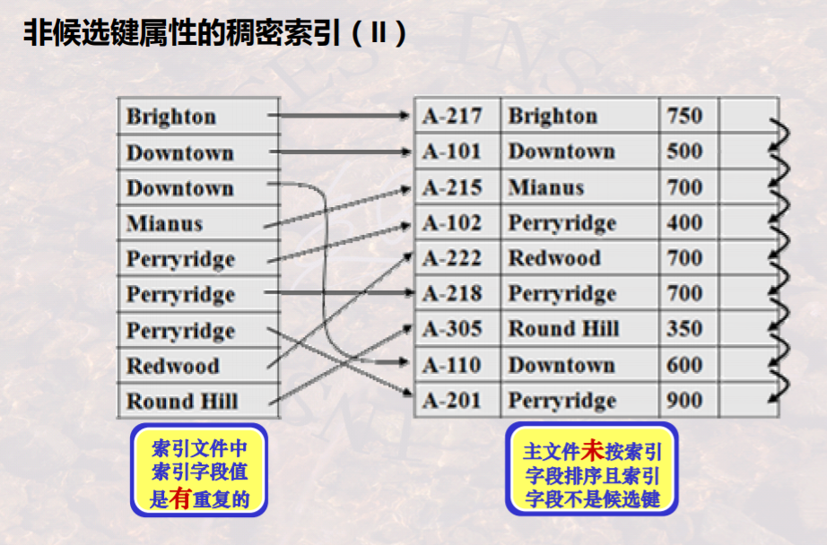

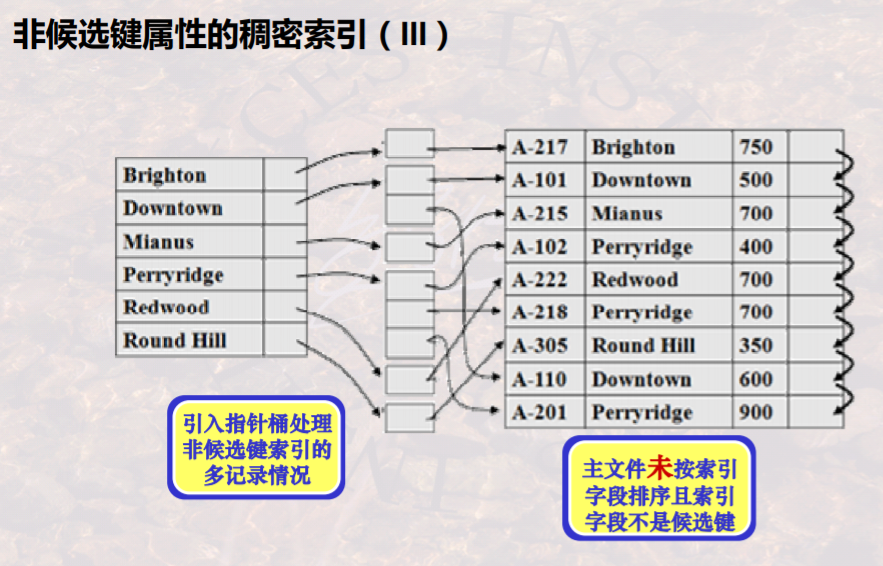

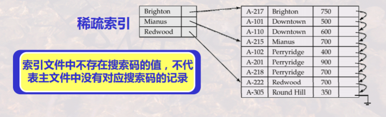

稀疏索引定位索引字段值为 K的记录，需要首先找相邻的小于K的最大索引字段值所对应的索引项，从该索引项所对应的记录开始顺序进行Table的检索

## 主索引和辅助索引

### 主索引

对每一个存储块有一个索引项，索引项总数和存储表所占存储块数目相同

每一存储块的第一条记录，又称为锚记录

==主索引是稀疏索引==

主索引按索引字段排序，通常建立在有序主文件基于主码的排序字段上

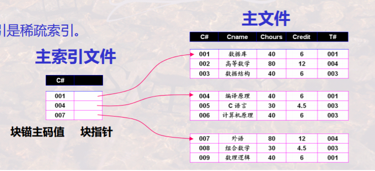

### 辅助索引

是定义在主文件的任一或多个非排序字段上的辅助存储结构

辅助索引通常是对某一非排序字段上的每一个不同值有一个索引项

**辅助索引是稠密索引**

- 一个主文件仅可以有一个主索引，可以有多个辅助索引
- 主索引通常建立在主码/排序码上，辅助索引建立在其它属性上
- 可以利用主索引重新组织主文件数据，但辅助索引不能改变主文件数据
- 主索引是稀疏索引，辅助索引是稠密索引

### 聚簇 非聚簇索引

聚簇索引—是指索引中邻近的记录在主文件中也是临近存储的；

非聚簇索引—是指索引中邻近的记录在主文件中不一定是邻近存储的

一个主文件只能有一个聚簇索引文件，但可以有多个非聚簇索引文件

主索引通常是聚簇索引(但其索引项总数不一定和主文件中聚簇字段上不同值的数目相 同，其和主文件存储块数目相同)；辅助索引通常是非聚簇索引

主索引/聚簇索引是能够**决定**记录存储位置的索引；而非聚簇索引则只能用 于查询，指出已存储记录的位置

## B+树

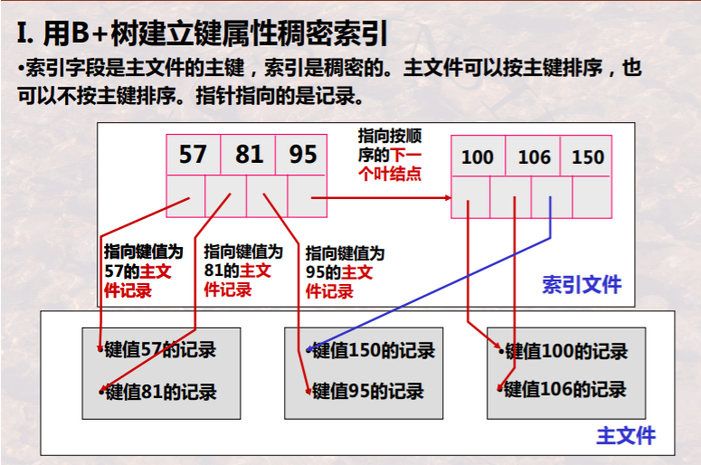

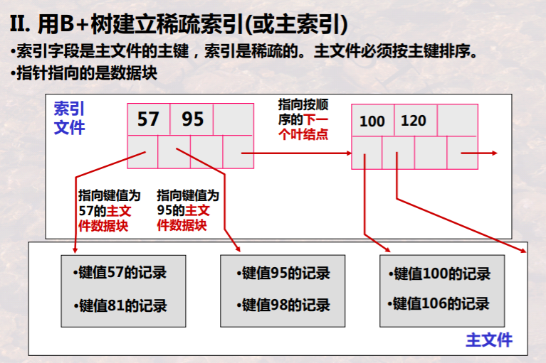

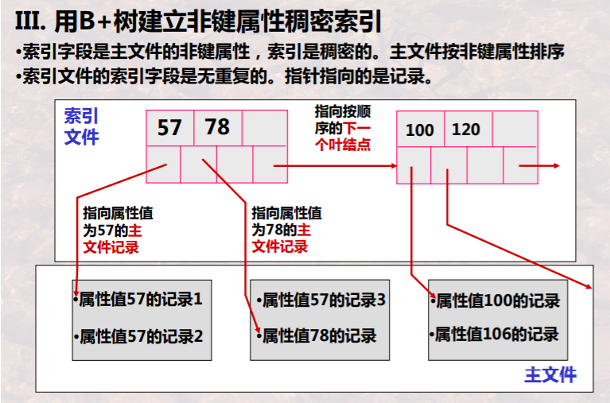

↑注意主文件按非键属性排序

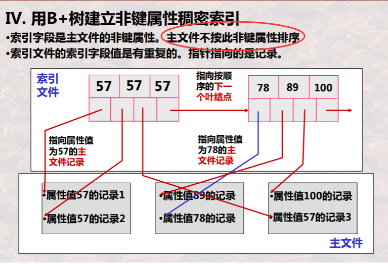

一棵带重复键值的B+Tree

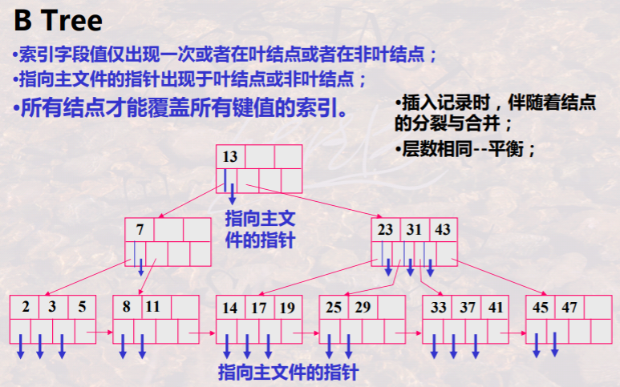

## 散列索引

- 桶M的数目是固定值：静态散列索引
- 桶的数目随键值增多而增加：动态散列索引
  - 可扩展散列索引
  - 线性散列索引

#### 可扩展三列索引

问题

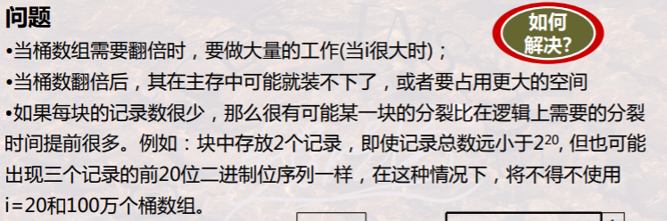

#### 线性散列索引

